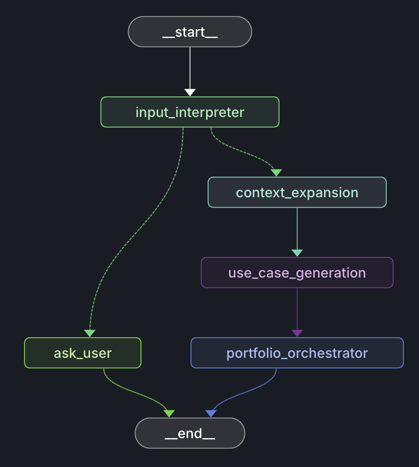

# Multi-Agent Extraction

<p align="center">
  
</p>

A lightweight LangGraph multi-agent pipeline that turns a plain-language business request into a structured portfolio of AI use cases.

- Reads your request and pulls out the business context: industry, functional area, strategic goals, constraints.
- Asks you first if the industry or functional area is missing.
- Expands that context with domain knowledge: key processes, pain points, KPIs, risks, data landscape, integrations.
- Generates 4–6 concrete AI use cases, each scored on business value, complexity, and time to value.
- Sorts the use cases into a portfolio: quick wins vs. strategic bets.

No RAG, no vector DB — just agents, graphs, and structured outputs.

## Target Workflow

```
INPUT_INTERPRETER → ASK_USER?
                  ↘ CONTEXT_EXPANSION → USE_CASE_GENERATION → PORTFOLIO_ORCHESTRATOR → DONE
```

## 📦 How to Run the Demo

1. setup `.evn`
```
GOOGLE_API_KEY=YOUR_API_KEY_HERE
OPENAI_API_KEY=YOUR_OPENAI_API_KEY_HERE
```

2.  Install dependencies:
    `npm install`

3.  Run demo:
    `npm run demo`

## 🔑 OpenAI (ChatGPT) API Key

1.  **Go to:**
    `https://platform.openai.com/api-keys`

2.  **Create** a new API key.

## 🔑 Gemini (Google) API Key

1.  **Go to:**
    `https://aistudio.google.com/app/apikey`

2.  **Create** a new API key.
